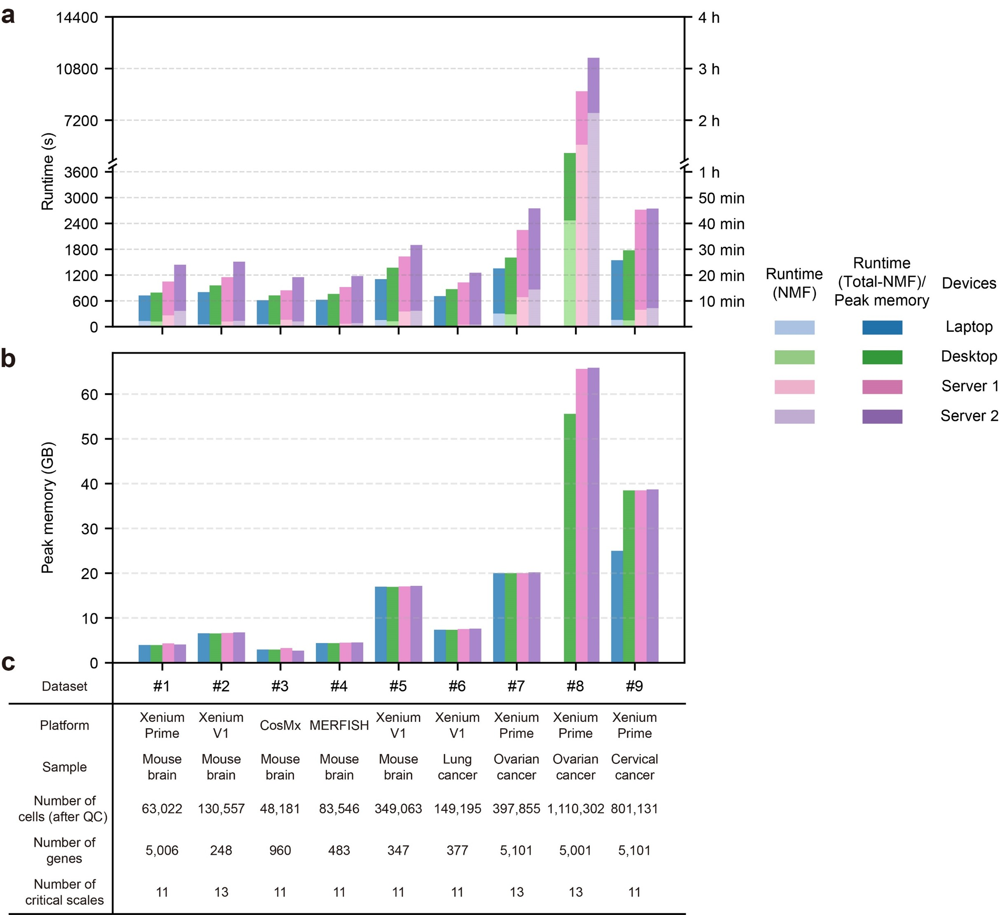

# SpatialZoomer: multi-scale feature analysis of spatial transcriptomics

The Python implementation of **SpatialZoomer**, a toolkit for **multi-scale spatial feature analysis** of single-cell resolved spatial transcriptomics via spectral graph signal processing. It scales to millions of cells with high computational efficiency and low hardware requirements.

1. [Introduction](#introduction)
2. [Demos](#demos)
3. [System Requirements](#system-requirements)
4. [Installation](#installation)
5. [Tutorials](#tutorials)
6. [Cite](#cite)


## Introduction
SpatialZoomer is a novel computational method that enables the multi-scale feature analysis of single-cell resolved spatial transcriptomics like a zoom-capable microscope. By modeling gene expression as signals on spatial neighbor graph and applying spectral graph signal processing, the method efficiently extracts spatial features across multiple scales and reveals biologically meaningful structures. It can automatically identify “critical” scales by partitioning the cross-scale similarity map via dynamic programming. 

<p align="center">
  <br>
  <em>Schematic overview of SpatialZoomer</em>
</p>

### Functions

- **Zoom-capable analysis across spatial scales**  
   SpatialZoomer enables the detection of spatial structures from **cells**, **niches**, to **domains** across multiple scales. It can cpature biologically meaningful signals at specific scales, such as those related to disease progression in perturbation or longitudinal scenarios.

- **Identification of spatially dependent subtypes**  
   As the spatial scale increases, SpatialZoomer progressively integrates spatial context from larger neighborhoods into each cell’s transcriptomic profile, potentially enabling cells from a single cluster at scale 0 to separate into spatially dependent subclusters at larger scales. These spatial contexts can amplify transcriptomic heterogeneity between biologically distinct subtypes.

- **Uncovering complex tissue architecture**  
   The extracted multi-scale features can be used to dissect the complex spatial organization.

### Advantages
- High computational efficiency with relatively low memory requirements (No GPU required).
- Fast runtime, even for large-scale datasets.
- Scalable to >1 million cells on desktops.

## Demos
Explore SpatialZoomer's multi-scale results by sliding the scale axis across four datasets on our interactive demo site:


👉 [**Demo Website**](https://li-xinqi.github.io/SpatialZoomer/)


## System Requirements
SpatialZoomer requires only a standard computer with sufficient RAM for in-memory operations and runs without the need for a GPU. It is lightweight and can be executed on **laptops, desktops, or servers**.

### Tested Devices:

| Device         | OS             | CPU                                           | RAM        |
|----------------|----------------|-----------------------------------------------|-------------|
| Laptop         | Windows 11     | AMD Ryzen 7 8845H, 3.8GHz | 32 GB       |
| Desktop        | Windows 10     | Intel Core i7-12700F, 2.10GHz    | 64 GB       | 
| Server 1       | CentOS 7        | Intel Xeon Gold 6254, 3.10GHz       | 256 GB      
| Server 2       | Ubuntu 18.04   | Intel Xeon E5-2630 v3, 2.40GHz    | 256 GB      

### Performance Results

- Most datasets can be processed **within 1 hour**, yielding 10+ scales with 3 clustering resolutions each.
- The Xenium Prime Cervical Cancer dataset (~800K cells, 5K genes) completes within 1 hour on a laptop.
- The Xenium Prime Ovarian Cancer dataset (>1.1M cells, 5K genes) completes within 2 hours on a desktop.


<p align="center">
  <br>
  <em>Runtime and memory profiling of SpatialZoomer across nine datasets and four devices</em>
</p>

## Installation
Requires **Python ≥ 3.9**

### Option 1: Recommended (using environment.yml)
```bash
# Create a virtual environment from the provided .yml file
conda env create -f environment.yml
conda activate spatialzoomer
```


### Option 2: Manual installation
```bash
# Create and activate a virtual environment
conda create -n spatialzoomer python=3.10 -y
conda activate spatialzoomer

# Install required dependency
conda install -c conda-forge pyarrow

# Install SpatialZoomer
pip install SpatialZoomer==0.1.1
```

## Tutorials
We provide Jupyter notebook tutorials that guide you through the key functionalities of SpatialZoomer.

Each tutorial includes links to download example datasets and step-by-step instructions to reproduce the analyses.

### Tutorial 1: Multi-Scale Analysis (`.ipynb`)

Automatically selects multiple critical scales from single-cell resolved spatial transcriptomics data and identifies spatial structures at each scale.

📘 [Multi-scale analysis: Vizgen MERFISH Mouse Brain](./examples/Tutorial1_MERFISH_Mouse_Brain_Multi-scale_Analysis.ipynb)

📘 [Multi-scale analysis: Xenium Prime Mouse Brain](./examples/Tutorial1_Xenium_Prime_Mouse_Brain_Multi-scale_Analysis.ipynb)

📘 [Multi-scale analysis: Xenium v1 Lung Cancer](./examples/Tutorial1_Xenium_Lung_Cancer_Multi-scale_Analysis.ipynb)

📘 [Multi-scale analysis: Xenium Prime Ovarian Cancer](./examples/Tutorial1_Xenium_Prime_Ovarian_Cancer_Multi-scale_Analysis.ipynb)

### Tutorial 2: Identification of Spatially Dependent Clusters (`.ipynb`)
As the spatial scale increases, cells progressively incorporate broader context information, leading to the separation of spatially dependent subclusters.

📘 [Identification of spatially dependent clusters: Xenium v1 Lung Cancer](./examples/Tutorial2_Xenium_Lung_Cancer_Subcluster.ipynb)

📘 [Identification of spatially dependent clusters: Xenium Prime Ovarian Cancer](./examples/Tutorial2_Xenium_Prime_Ovarian_Cancer_Subcluster.ipynb)

### Data downloads
All datasets required for the tutorials are available on [Google Cloud](https://drive.google.com/drive/folders/1MhL9rV6y0_SvJfjgf_nqXpZ7YqerB5Bj?usp=drive_link)
Each tutorial also provides a direct download link for its corresponding dataset.

## Cite
Xinqi Li#, Yuhan Fan#, Yue Han, Wenbo Guo, Jingmin Huang, Nan Yan, Zeyu Chen, Yanhong Wu, Yuxin Miao, Lin Hou, Xuegong Zhang, Zeyu Chen, Jin Gu*. SpatialZoomer: multi-scale feature analysis of spatial transcriptomics. bioRxiv (2025).
